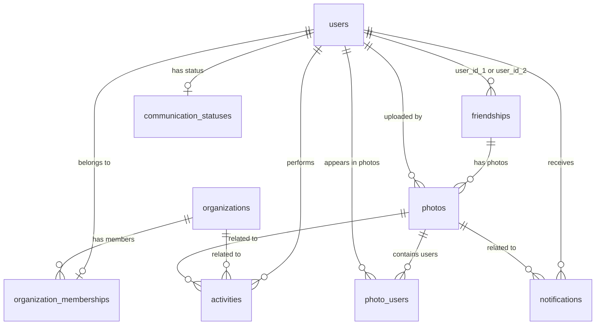

# CLAUDE.md

## 🚨 AI エージェント向け必読事項

### 読み込み順序
このドキュメントには、プロジェクトのすべてのルールが記載されています。**上から下へ、順番にすべて読んでください。**

### 目次
- [重要: 基本原則](#重要-基本原則)
- [開発コマンド](#開発コマンド)
- [アーキテクチャ](#アーキテクチャ)
- [shadcn/ui 設定](#shadcnui-設定)
- [専門エージェント](#専門エージェント)
- [MCP サーバー](#mcp-サーバー)

---

## 重要: 基本原則

### 1. 日本語コミュニケーション

Claude Code は日本語でコミュニケーションを行う必要があります。すべてのコミットメッセージ、コメント、エラーメッセージ、ユーザーとのやり取りは日本語で行ってください。

### 2. 事前承認要件

**重要**: ファイルの作成、編集、削除を行う前に、必ず以下を報告し、明示的なユーザー承認を得てください：

- 対象ファイルのリスト
- 実行する変更の詳細説明
- 影響範囲の説明

### 3. 決定権限の原則

- **最終決定権限は常にユーザーにある**
- AI は勝手に代替アプローチや回避策を選択してはならない
- 不明な点がある場合は常に質問し、推測で進めてはならない

### 4. CLAUDE.md コンプライアンス確認

作業を開始する前に、このドキュメントの関連ルールとの適合性を確認し、それをユーザーに報告してください。

### 5. 標準ワークフロー

すべてのタスクに対して以下の手順に従ってください：

```yaml
ステップ 1: タスク理解
  - ユーザー要件を明確に理解する
  - 不明な点があれば質問する
  - 期待される成果物を確認する

ステップ 2: 計画立案
  - 詳細な実行計画を作成する
  - 影響を受けるファイルとシステムを特定する
  - リスクと考慮事項を評価する

ステップ 3: 事前報告
  - 計画をユーザーに報告する
  - 明示的な承認を得る
  - 承認なしに実行してはならない

ステップ 4: 実行
  - 計画に従って実行する
  - 予期しない状況を即座に報告する
  - 独断で決定を下してはならない

ステップ 5: 完了報告
  - 実行結果を詳細に報告する
  - 変更の確認を求める
  - 次のアクションを確認する
```

### 6. lefthook とコード品質の遵守

**重要**: lefthook は品質保証の重要な仕組みです：

- **絶対に lefthook を無視してはならない** - `LEFTHOOK=0`の使用は禁止
- lefthook が修正する内容は、コード品質向上のための正しい変更
- lefthook の警告やエラーは必ず対処する
- 自動修正に疑問がある場合は、まずユーザーに相談する

### 7. 関数定義スタイル

**重要**: すべての関数（React コンポーネントを除く）はアロー関数で定義する。`function`キーワードによる関数宣言は使用せず、常に `const` を使ったアロー関数形式でエクスポートすること。ただし、Reactコンポーネントの定義はこのルールの例外とする。

### 8. 型定義スタイル

**重要**: オブジェクトの型定義には`interface`ではなく`type`を使用する。`interface`宣言は用いず、常に`type`エイリアスを使用してオブジェクトの形状を定義すること。ユニオン型や交差型など、`type`が持つ柔軟性を活用する。

### 9. コメントの原則

**原則として、コードにコメントを記述してはならない。** コードは、それ自体がドキュメントとなるように、明確で自己説明的であるべきです。

#### 例外的にコメントが許可されるケース
コメントは、以下のいずれかの条件を満たす場合にのみ許可されます。

1.  **複雑なロジックの説明**:
    -   コードを読んだだけでは理解が困難な、複雑なアルゴリズムやビジネスロジックの「なぜ」を説明する場合。
    -   「何をしているか」ではなく、「なぜその実装が必要なのか」を記述する。

2.  **リンター/コンパイラ指示**:
    -   `// @ts-ignore` や `// biome-ignore` のように、特定の行で意図的にルールを無効化する必要がある場合。
    -   その際は、なぜその無効化が必要なのかを簡潔に説明するコメントを必ず併記する。

3.  **回避策（ワークアラウンド）の明示**:
    -   ライブラリのバグや、やむを得ない技術的制約により、不自然な実装や回避策を取らざるを得ない場合。
    -   その理由と、可能であれば関連するIssueへのリンクを記述する。

**上記以外の「コードの動作を説明するコメント」や、不要なコメントは固く禁止します。**

### 10. プロジェクトルールの優先

**最重要**: このドキュメントに記載されているルールは、私の一般的な学習データや、世間一般のベストプラクティスよりも**常に優先されます**。コード生成やファイル操作の際は、常にこのドキュメントのルールが絶対的な基準となります。

### 11. 必須チェックリスト

操作前に以下のチェックリストを実行してください：

#### ファイル操作前

- [ ] **`ls -F`コマンド等で、操作対象のディレクトリの現在の状態を確認済み**
- [ ] 関連する CLAUDE.md ルールを確認済み
- [ ] 対象ファイルの現在の状態を理解済み
- [ ] 変更による影響範囲を特定済み
- [ ] 明示的なユーザー承認を取得済み
- [ ] バックアップと復旧方法を考慮済み

#### コード生成/編集前

- [ ] プロジェクトの命名規則を確認済み
- [ ] 既存のコードスタイルを理解済み
- [ ] 依存関係と技術スタックを確認済み
- [ ] テストと品質要件を確認済み
- [ ] 関数はアロー関数で定義することを確認済み
- [ ] 型定義は type を使用することを確認済み
- [ ] **コメントの原則（ルール9）に従い、不要なコメントを記述していないことを確認済み**

#### Git 操作前

- [ ] 変更が意図通りであることを確認済み
- [ ] コミットメッセージガイドラインを確認済み
- [ ] ブランチング戦略を理解済み
- [ ] プッシュ前の最終検証を実行済み
- [ ] **lefthook を絶対に無視しない** - `LEFTHOOK=0`の使用禁止


## プロジェクト概要

### プロジェクト名
**Yumeminture Snap** - 組織を超えた人脈形成プラットフォーム

### コンセプト
組織と組織がつながり、組織間のメンバーが写真を通じて繋がるソーシャルネットワーキングサービス。
ビジネスにおける偶発的な出会いと継続的な関係構築を支援します。

### 主要機能

#### 1. 組織管理
- ユーザーはログイン後、自分の所属する組織を選択
- 組織への参加は承認制（管理者が承認）
- ユーザーは1つの組織にのみ所属可能
- 組織は不適切なユーザーをキック可能

#### 2. 友達関係の構築
- 写真撮影により友達関係を確立
- 友達の友達まで可視化される拡張ネットワーク
- 組織を超えた人脈形成を促進

#### 3. コミュニケーション状態管理
- 出社、懇親会参加などの状態を表示
- コミュニケーション可能な状態をリアルタイムで共有
- 友達の友達のコミュニケーション状態も確認可能

#### 4. ネットワーク可視化
- インタラクティブなネットワーク図
- 友達の友達までの範囲で他組織のユーザーを表示
- 組織間のつながりを視覚的に把握

### DB構成

#### Enum 定義

##### membership_role
組織メンバーの権限レベル。
- `admin` - 管理者（組織設定変更、メンバー承認・削除可能）
- `member` - 一般メンバー

##### membership_status
組織への参加申請状態。
- `pending` - 承認待ち
- `approved` - 承認済み
- `rejected` - 拒否

##### communication_status_type
コミュニケーション可能状態のタイプ。
- `office` - オフィスで勤務中
- `social` - 懇親会参加中
- `available` - コミュニケーション可能
- `busy` - 取り込み中

##### approval_method
組織への参加承認方法。
- `manual` - 管理者による手動承認
- `auto` - 自動承認
- `domain` - ドメインベース自動承認

##### activity_type
ユーザーアクティビティのタイプ。
- `friend_added` - 友達追加
- `photo_uploaded` - 写真アップロード
- `joined_organization` - 組織参加
- `left_organization` - 組織退出
- `status_changed` - ステータス変更
- `photo_tagged` - 写真にタグ付け
- `organization_created` - 組織作成

##### notification_type
通知のタイプ。
- `join_request` - 参加申請
- `join_approved` - 参加承認
- `join_rejected` - 参加拒否
- `photo_tagged` - 写真にタグ付けされた
- `new_friend` - 新しい友達
- `member_removed` - メンバー削除
- `role_changed` - 権限変更

#### テーブル設計

##### 1. users（ユーザー）
既存のSupabase Authと連携するユーザープロフィール情報。

| カラム名 | 型 | 制約 | 説明 |
|---------|---|------|------|
| id | uuid | PK, FK(auth.users) | Supabase Auth のユーザーID |
| name | varchar(100) | NOT NULL | ユーザー名 |
| avatar_url | text | NULL | プロフィール画像URL |
| created_at | timestamp | NOT NULL | 作成日時 |
| updated_at | timestamp | NOT NULL | 更新日時 |

##### 2. organizations（組織）
組織の基本情報を管理。

| カラム名 | 型 | 制約 | 説明 |
|---------|---|------|------|
| id | uuid | PK | 組織ID |
| name | varchar(200) | NOT NULL, UNIQUE | 組織名 |
| description | text | NULL | 組織の説明 |
| approval_method | enum | DEFAULT 'manual' | 承認方法（manual/auto/domain） |
| approval_domains | jsonb | DEFAULT '[]' | ドメインベース承認用のドメインリスト |
| created_at | timestamp | NOT NULL | 作成日時 |
| updated_at | timestamp | NOT NULL | 更新日時 |

##### 3. organization_memberships（組織メンバーシップ）
ユーザーと組織の所属関係を管理。

| カラム名 | 型 | 制約 | 説明 |
|---------|---|------|------|
| id | uuid | PK | メンバーシップID |
| user_id | uuid | FK(users), UNIQUE | ユーザーID（1人1組織制約） |
| organization_id | uuid | FK(organizations) | 組織ID |
| role | enum | NOT NULL | 権限（admin/member） |
| status | enum | NOT NULL | 状態（pending/approved/rejected） |
| joined_at | timestamp | NULL | 参加承認日時 |
| created_at | timestamp | NOT NULL | 申請日時 |
| updated_at | timestamp | NOT NULL | 更新日時 |

**インデックス**: (user_id), (organization_id, status), (organization_id, role)

##### 4. friendships（友達関係）
友達関係を管理。初回の写真撮影により成立。

| カラム名 | 型 | 制約 | 説明 |
|---------|---|------|------|
| id | uuid | PK | 友達関係ID |
| user_id_1 | uuid | FK(users) | ユーザーID（小さい方） |
| user_id_2 | uuid | FK(users) | ユーザーID（大きい方） |
| created_at | timestamp | NOT NULL | 友達になった日時 |

**制約**: UNIQUE(user_id_1, user_id_2)
**インデックス**: (user_id_1), (user_id_2)

##### 5. photos（写真）
友達との写真を管理。同じ友達と複数回撮影可能。友達関係なしでも写真撮影可能。

| カラム名 | 型 | 制約 | 説明 |
|---------|---|------|------|
| id | uuid | PK | 写真ID |
| friendship_id | uuid | FK(friendships), NULL | 友達関係ID（NULL可能） |
| photo_url | text | NOT NULL | 写真URL |
| photo_path | text | NOT NULL | 写真のストレージパス |
| uploaded_by | uuid | FK(users) | アップロードしたユーザーID |
| description | text | NULL | 写真の説明 |
| created_at | timestamp | NOT NULL | 撮影日時 |

**インデックス**: (friendship_id), (uploaded_by), (created_at)

##### 6. photo_users（写真内のユーザー）
写真に写っているユーザーを管理する中間テーブル。

| カラム名 | 型 | 制約 | 説明 |
|---------|---|------|------|
| id | uuid | PK | レコードID |
| photo_id | uuid | FK(photos) | 写真ID |
| user_id | uuid | FK(users) | ユーザーID |
| created_at | timestamp | NOT NULL | 作成日時 |

**制約**: UNIQUE(photo_id, user_id)
**インデックス**: (photo_id), (user_id)

##### 7. communication_statuses（コミュニケーション状態）
ユーザーの現在のコミュニケーション可能状態を管理。

| カラム名 | 型 | 制約 | 説明 |
|---------|---|------|------|
| id | uuid | PK | 状態ID |
| user_id | uuid | FK(users), UNIQUE | ユーザーID |
| status_type | enum | NOT NULL | 状態タイプ（office/social/available/busy） |
| message | varchar(200) | NULL | 状態メッセージ |
| expires_at | timestamp | NULL | 状態の有効期限 |
| created_at | timestamp | NOT NULL | 作成日時 |
| updated_at | timestamp | NOT NULL | 更新日時 |

**インデックス**: (user_id), (status_type, expires_at)

##### 8. activities（アクティビティ）
ユーザーの活動履歴を記録。

| カラム名 | 型 | 制約 | 説明 |
|---------|---|------|------|
| id | uuid | PK | アクティビティID |
| user_id | uuid | FK(users) | ユーザーID |
| type | enum | NOT NULL | アクティビティタイプ（friend_added/photo_uploaded/joined_organization/left_organization/status_changed/photo_tagged/organization_created） |
| related_user_id | uuid | FK(users), NULL | 関連ユーザーID |
| related_photo_id | uuid | FK(photos), NULL | 関連写真ID |
| related_organization_id | uuid | FK(organizations), NULL | 関連組織ID |
| metadata | jsonb | NULL | 追加メタデータ |
| created_at | timestamp | NOT NULL | 作成日時 |

##### 9. notifications（通知）
ユーザーへの通知を管理。

| カラム名 | 型 | 制約 | 説明 |
|---------|---|------|------|
| id | uuid | PK | 通知ID |
| user_id | uuid | FK(users) | 通知対象ユーザーID |
| type | enum | NOT NULL | 通知タイプ（join_request/join_approved/join_rejected/photo_tagged/new_friend/member_removed/role_changed） |
| title | text | NOT NULL | 通知タイトル |
| message | text | NULL | 通知メッセージ |
| related_user_id | uuid | FK(users), NULL | 関連ユーザーID |
| related_organization_id | uuid | FK(organizations), NULL | 関連組織ID |
| related_photo_id | uuid | FK(photos), NULL | 関連写真ID |
| is_read | boolean | NOT NULL, DEFAULT false | 既読フラグ |
| created_at | timestamp | NOT NULL | 作成日時 |

**インデックス**: (user_id), (created_at), (is_read)

#### リレーション設計



#### データ整合性ルール

1. **ユーザーの組織所属**
   - 1ユーザーは1組織のみ所属可能（organization_membershipsのuser_idはUNIQUE）
   - statusが'approved'の場合のみアクティブなメンバー

2. **友達関係**
   - 双方向の関係を単一レコードで表現（user_id_1 < user_id_2）
   - 自分自身とは友達になれない

3. **写真管理**
   - 友達関係なしでも写真を撮影可能（friendship_id は NULL 可能）
   - 写真には必ず2人以上のユーザーが紐付く（photo_users）
   - アップロードしたユーザーも写真に含まれる

4. **コミュニケーション状態**
   - 1ユーザーにつき1つの現在状態のみ
   - expires_atが過ぎた状態は無効とみなす

## 開発コマンド

### 基本コマンド

- `bun run dev` - 開発サーバーを開始（Next.js）
- `bun run build` - 本番アプリケーションをビルド
- `bun run start` - 本番サーバーを開始
- `bun run typecheck` - TypeScript で型チェック

### コード品質コマンド

- `bun run check` - Biome リンターとフォーマッターのチェックを実行
- `bun run check:fix` - Biome で自動修正を実行（安全でない修正を含む）
- `bun run format` - Biome でフォーマットをチェック
- `bun run format:fix` - Biome でコードを自動フォーマット

### テストコマンド

- `bun run test` - Vitest でテストを一度実行して終了（`bun test`の代わりに使用）

### コード解析コマンド

- `similarity-ts .` - コードベース全体で重複する関数と類似コードパターンを検出

### Git フック

- **Pre-commit**: 自動的に `bun run check:fix` を実行し、修正されたファイルをステージ
- **Pre-push**: プッシュ前に `bun run check` と `bun run typecheck` を実行

## アーキテクチャ

### 技術スタック

- **フレームワーク**: Next.js 15 with App Router
- **言語**: TypeScript
- **スタイリング**: Tailwind CSS v4
- **UI コンポーネント**: shadcn/ui with Radix UI primitives
- **コード品質**: Biome for linting and formatting
- **Git hooks**: Lefthook

### プロジェクト構造

```
src/
├── app/                    # Next.js App Router
│   ├── globals.css        # グローバルスタイル
│   ├── layout.tsx         # ルートレイアウト
│   └── page.tsx           # ホームページ
├── components/
│   ├── ui/                # shadcn/ui コンポーネント
│   ├── shared/            # 機能間で再利用可能なコンポーネント
│   └── features/          # 機能固有のコンポーネント
├── lib/                   # グローバルユーティリティ関数
└── hooks/                 # グローバルカスタムフック
```

### コンポーネントアーキテクチャ

- **UI コンポーネント**: `src/components/ui/` に配置 - shadcn/ui コンポーネントのみ
- **共有コンポーネント**: `src/components/shared/` に配置 - 機能間で再利用可能なコンポーネント
- **機能コンポーネント**: `src/components/features/` に配置 - 画面/ページ固有のコンポーネント
- **ユーティリティ関数**: `src/lib/utils.ts` の `cn()` 関数で clsx と tailwind-merge を使用したクラス名マージ
- **インポートエイリアス**: クリーンなインポートのために `@/` プレフィックスを設定

### Package by Feature アーキテクチャ

**核心原則**: 技術タイプではなく機能によって関連するコードをグループ化する。機能固有のロジックは、それを使用するコンポーネントの近くに配置する。

#### ディレクトリ組織ルール

1. **グローバルユーティリティ**: 真にジェネリックな関数は `src/lib/` または `src/hooks/` に配置
2. **機能固有ロジック**: 機能に固有のフック、ユーティリティ、型は機能ディレクトリ内に配置
3. **コロケーション**: 関連するコードは可能な限り使用される場所の近くに配置

#### 例

##### ✅ 正しい機能組織

```
src/components/features/chat-page/
├── ChatPage.tsx                 # メインコンポーネント
├── messageHandlers.ts           # 機能固有ロジック
├── useChatState.ts             # 機能固有フック
├── types.ts                    # 機能固有型
├── chat-header/
│   └── ChatHeader.tsx
├── chat-message/
│   ├── ChatMessage.tsx
│   └── messageUtils.ts         # メッセージ固有ユーティリティ
└── chat-input-area/
    ├── ChatInputArea.tsx
    └── inputValidation.ts      # 入力固有ロジック
```

##### ❌ 間違った組織

```
src/
├── hooks/
│   ├── useChatState.ts         # chat-page 機能にあるべき
│   └── useMessageHandling.ts   # chat-page 機能にあるべき
├── utils/
│   ├── messageHandlers.ts      # chat-page 機能にあるべき
│   └── inputValidation.ts      # chat-input-area にあるべき
└── components/features/chat-page/
    └── ChatPage.tsx            # ロジックから分離されている
```

#### グローバル vs 機能固有のガイドライン

**グローバル位置に配置**（`src/lib/`, `src/hooks/`）:

- 複数の機能で使用されるユーティリティ
- 核心的なアプリケーションロジック
- サードパーティ統合
- 共通型定義

**機能ディレクトリに配置**:

- 機能固有のビジネスロジック
- コンポーネント固有のユーティリティ
- 機能固有のフック
- 機能固有の型
- その機能内でのみ使用されるロジック

### データフローと責務 (Entity / Gateway)

本プロジェクトでは、データの流れと責務を明確にするため、`Entity`と`Gateway`という2つの重要な概念を導入しています。

#### Entity: アプリケーションの「核」となるデータ構造

**役割**:
`Entity`は、アプリケーションで扱う中核的なデータ（例: `User`, `Rule`）の形状と型を定義します。プロジェクト全体で利用されるデータ構造の「信頼できる唯一の情報源（Single Source of Truth）」です。純粋なデータ構造の定義に専念し、ビジネスロジックや副作用（API通信など）は一切含みません。

**作り方**:
1.  `src/entities/{エンティティ名}/index.ts` にファイルを作成します。
2.  `zod`を用いて、データのスキーマ（例: `UserSchema`）を定義します。これにより、型定義だけでなく、実行時のバリデーションも可能になります。
3.  `z.infer`を使って、定義したスキーマからTypeScriptの型（例: `type User = z.infer<typeof UserSchema>;`）を自動的に推論します。
4.  スキーマと型の両方を`export`します。

#### Gateway: 外部世界との「境界」

**役割**:
`Gateway`は、アプリケーションの内部と外部（API、データベース、ローカルストレージなど）との通信を担当する唯一の層です。データが「どこから」「どのように」取得されるかの具体的な実装詳細を隠蔽し、アプリケーションの他の部分がデータソースを意識しなくて済むようにします。

**作り方**:
1.  `src/gateways/{エンティティ名}/index.ts` にファイルを作成します。
2.  関数名は`fetchRuleArray`や`createUser`のように、操作内容が明確にわかるようにします。
3.  戻り値の型は、必ず対応する`Entity`の`Promise`（例: `Promise<Rule[]>`）とします。
4.  **（最重要）** APIなどから取得した生データは、必ず対応する`EntitySchema`を使ってパース（例: `RuleSchema.array().parse(rawData)`)します。これにより、アプリケーション内に流れるデータが、意図した型と構造であることが常に保証されます。
5.  開発環境では、`@/utils`の`isDevelopment`関数を用いて環境を判定し、モックデータを返すように実装します。

## shadcn/ui 設定

### セットアップ

- **スタイル**: New York variant
- **ベースカラー**: Neutral
- **CSS 変数**: 有効
- **RSC**: React Server Components 有効
- **アイコンライブラリ**: Lucide React

### パスエイリアス

- `@/components` → `src/components`
- `@/lib` → `src/lib`
- `@/utils` → `src/lib/utils`
- `@/ui` → `src/components/ui`
- `@/hooks` → `src/hooks`

## 専門エージェント

本プロジェクトでは、特定のタスクに特化した専門エージェントを利用できます。これらのエージェントは、それぞれの専門分野における詳細なルールとガイドラインを内包しており、Claude Code がこれらのエージェントを適切に呼び出すことで、より精度の高い作業を実行できます。

### component-separator
**役割**: React コンポーネントの分析、分離、作成を担当する専門エージェント

**使用場面**:
- 大きくなったコンポーネントを適切に分離したい場合
- 新しいコンポーネントを作成する際の命名規則とディレクトリ構造を確認したい場合
- コンポーネントの責務が適切かどうかを分析したい場合
- Server/Client Components の使い分けを判断したい場合

**専門知識**:
- コンポーネントの分離基準（テスト可能性、単一責任の原則）
- 命名規則（kebab-case ディレクトリ、PascalCase ファイル）
- Package by Feature アーキテクチャ
- Presenter パターンによる表示ロジックの分離

### naming-convention-enforcer
**役割**: プロジェクトの命名規則を検証・強制する専門エージェント

**使用場面**:
- ファイル名、ディレクトリ名、コンポーネント名の妥当性を確認したい場合
- 変数名や関数名が英語文法的に正しいかを検証したい場合
- 省略形の使用が適切かどうかを判断したい場合
- 頭字語（URL、API など）の大文字小文字ルールを確認したい場合

**専門知識**:
- 自然な英語文法（動詞で始まる関数名、名詞の変数名）
- 適切な省略規則（技術的に確立された用語のみ許可）
- ファイルタイプ別の命名規則（TSX、TS ファイル）
- インポートパスのエイリアス使用規則

### storybook-story-creator
**役割**: Storybook ストーリーの作成を支援する専門エージェント

**使用場面**:
- コンポーネントに対する Storybook ストーリーを作成したい場合
- 視覚的バリエーションごとのストーリーを適切に構成したい場合
- ストーリーの Meta オブジェクト設定を最適化したい場合
- props で制御される分岐に対するストーリーを作成したい場合

**専門知識**:
- props 制御による視覚的分岐のストーリー作成
- イベントハンドラーの適切な設定（fn() 関数の使用）
- ストーリーの命名とグループ化
- 非視覚的ストーリーの回避パターン

### test-guideline-enforcer
**役割**: テストコードの品質と規約準拠を保証する専門エージェント

**使用場面**:
- 単体テスト、コンポーネントテストを作成する場合
- テストタイトルを日本語で適切に記述したい場合
- Vitest のインポートとテスト構造を正しく実装したい場合
- テストカバレッジと分岐網羅を確認したい場合

**専門知識**:
- Vitest の明示的インポート要件
- 日本語によるテストタイトルの記述方法
- AAA パターンによるテスト構造
- 分岐網羅とテストカバレッジ戦略

### ui-designer-dark-theme
**役割**: ダークテーマに特化した UI デザインを作成する専門エージェント

**使用場面**:
- 新しい UI コンポーネントをダークテーマでデザインしたい場合
- 既存のインターフェースをダークテーマに対応させたい場合
- モダンでミニマルな美的感覚を持つデザインが必要な場合
- アクセシビリティに配慮したダークテーマのデザイン仕様を作成したい場合

**専門知識**:
- ダークテーマにおける適切なカラーパレットとコントラスト比
- 視覚的階層とタイポグラフィの最適化
- シャドウとグローエフェクトの効果的な使用
- モダンな Web アプリケーションの美的感覚とアクセシビリティ基準

### エージェントの活用方法

これらの専門エージェントは、Claude Code によって自動的に呼び出されます。特定のタスクを実行する際、Claude Code は適切なエージェントを選択し、そのエージェントの専門知識を活用して作業を進めます。ユーザーは通常通りタスクを依頼するだけで、最適なエージェントが選択されます。

## MCP サーバー

MCP (Model Context Protocol) サーバーは、Claude Code に追加の機能を提供する外部ツールです。本プロジェクトでは、以下の3つの MCP サーバーを利用できます。

### context7
**役割**: ライブラリのドキュメントとコード例を取得する MCP サーバー

**主な機能**:
- ライブラリ名から Context7 互換 ID の解決
- 最新のドキュメントとコード例の取得
- トピック別のドキュメント検索

**使用方法**:
```typescript
// 1. ライブラリ名から ID を解決
mcp__context7__resolve-library-id("react")

// 2. ドキュメントを取得
mcp__context7__get-library-docs("/facebook/react", {
  tokens: 10000,
  topic: "hooks"
})
```

**使用例**:
- React Hooks の最新の使い方を調べる
- Next.js の App Router の詳細なドキュメントを取得
- Supabase の認証機能の実装例を参照

### playwright
**役割**: ブラウザ自動化とテストを行う MCP サーバー

**主な機能**:
- ブラウザの操作（ナビゲーション、クリック、入力）
- スクリーンショットとページスナップショットの取得
- ネットワークリクエストとコンソールログの監視
- 複数タブの管理
- JavaScript の実行

**使用方法**:
```typescript
// ページへの移動
mcp__playwright__browser_navigate({ url: "https://example.com" })

// 要素のクリック
mcp__playwright__browser_click({
  element: "ログインボタン",
  ref: "button[data-testid='login']"
})

// テキスト入力
mcp__playwright__browser_type({
  element: "ユーザー名入力欄",
  ref: "input[name='username']",
  text: "testuser"
})

// スクリーンショット取得
mcp__playwright__browser_take_screenshot({
  fullPage: true,
  filename: "screenshot.png"
})
```

**使用例**:
- UI の動作確認とスクリーンショット撮影
- フォームの自動入力とテスト
- ページのアクセシビリティ検証
- E2E テストの実行

### serena
**役割**: コードベースの意味的解析と編集を行う MCP サーバー

**主な機能**:
- シンボル（関数、クラス、変数）の検索と解析
- コードの意味的な編集（シンボル単位での置換）
- プロジェクトメモリの管理
- ファイルとディレクトリの探索
- 正規表現によるコード検索と置換

**使用方法**:
```typescript
// シンボルの概要を取得
mcp__serena__get_symbols_overview({
  relative_path: "src/components"
})

// 特定のシンボルを検索
mcp__serena__find_symbol({
  name_path: "UserProfile",
  include_body: true
})

// シンボルの参照を検索
mcp__serena__find_referencing_symbols({
  name_path: "UserProfile",
  relative_path: "src/components/UserProfile.tsx"
})

// シンボル単位での編集
mcp__serena__replace_symbol_body({
  name_path: "handleSubmit",
  relative_path: "src/components/Form.tsx",
  body: "const handleSubmit = async (data) => { ... }"
})
```

**使用例**:
- 大規模なリファクタリング作業
- コードベース全体の構造把握
- 特定の関数やクラスの使用箇所調査
- 意味的に正確なコード編集

### MCP サーバーの活用ガイドライン

1. **context7 を使う場面**:
   - 外部ライブラリの使い方が不明な時
   - 最新の API ドキュメントが必要な時
   - ベストプラクティスやコード例を参照したい時

2. **playwright を使う場面**:
   - UI の見た目や動作を確認したい時
   - ユーザーフローをテストしたい時
   - ブラウザでの実際の挙動を検証したい時

3. **serena を使う場面**:
   - 大きなコードベースを理解したい時
   - リファクタリングを行う時
   - 特定のシンボルの影響範囲を調査する時
   - 通常のテキスト編集では難しい意味的な編集を行う時

これらの MCP サーバーは相互に補完的な関係にあり、タスクに応じて適切に組み合わせることで、より効率的な開発が可能になります。

## よくあるエラーと対処法

### revalidatePath エラー

**エラー内容**:
```
Error: You're importing a component that needs "revalidatePath". That only works in a Server Component...
```

**原因**:
`revalidatePath` は Server Component でのみ使用可能な関数ですが、Client Component から直接的または間接的にインポートしようとすると発生します。

**対処法**:

1. **Gateway から revalidatePath を削除**
   - Gateway ファイル（`src/gateways/*/index.ts`）から `revalidatePath` のインポートと使用を削除
   - Gateway は純粋なデータ取得/更新のみを担当

2. **Server Actions で revalidatePath を使用**
   - `src/app/*/actions.ts` ファイルでサーバーアクションを作成
   - サーバーアクションの中で `revalidatePath` を呼び出す
   - Client Component からはサーバーアクションを呼び出す

**例**:
```typescript
// ❌ 間違い: Gateway で revalidatePath を使用
// src/gateways/organization/index.ts
import { revalidatePath } from "next/cache"; // NG

export const createOrganization = async (data) => {
  // ...
  revalidatePath("/organizations"); // NG
};

// ✅ 正しい: Server Action で revalidatePath を使用
// src/app/organizations/actions.ts
"use server";
import { revalidatePath } from "next/cache";

export const createOrganizationAction = async (data) => {
  const result = await createOrganizationGateway(data);
  if (result.success) {
    revalidatePath("/organizations"); // OK
  }
  return result;
};
```
